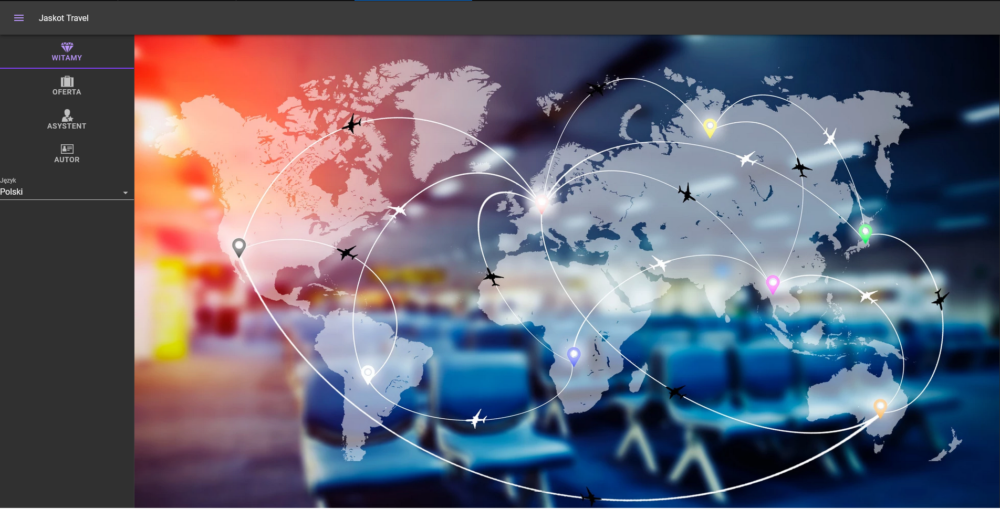
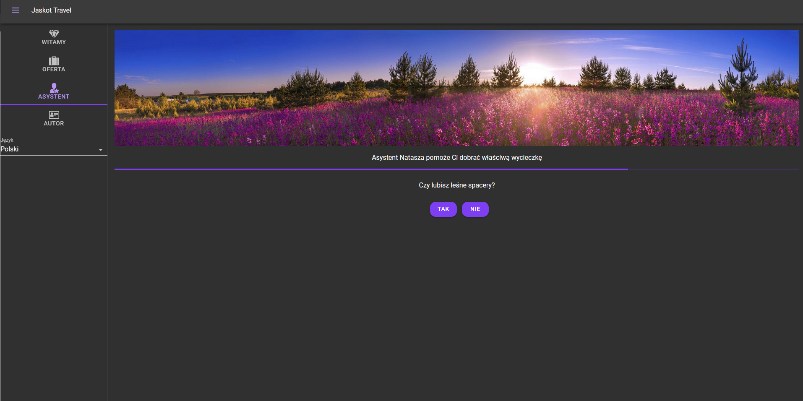

# Turist Portal

Educational project

A simple travel agency application containing an assistant that helps the user choose the best travel direction for him. The project based on an intelligent expert system that selects the right offer based on the user's response. 

* Author: Karol Jaskot
* E-mail: karol.jaskot97@gmail.com

##

This project is hosted and ready to use.  
App adress:
http://www.karol-jaskot.pl:8082/

### Tech

* SpringBoot 
* Hibernate
* H2 database
* Vaadin 

### Front image
Welcome view


Expert View


### Installation

IntelijIdea is required to open this program. 


Install project:
```sh
mvn clean
mvn install
```
To start this project:
```sh
mvn spring-boot:run
```

Thanks to that it will be available at =  localhost: 8080


If port 8080 is not available, you can change the address in the file:
```sh
/src/main/resources/application.properties
```